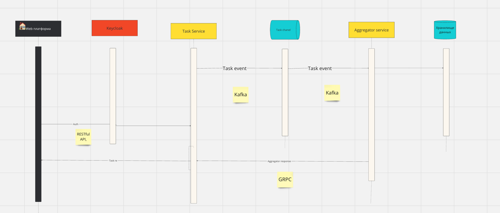
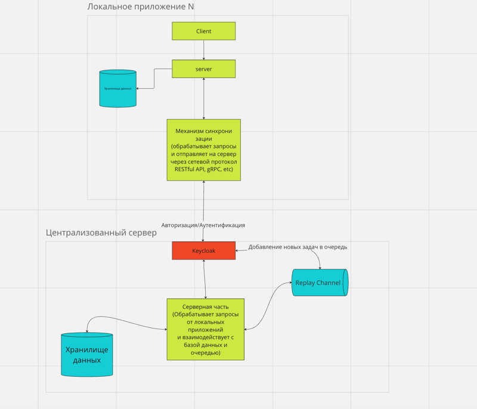

# Проблематика

Существует необходимость разработать систему управления задачами для сотрудников розничного магазина с целью повышения
эффективности и оптимизации рабочего времени.

# Варианты решения

## Вариант 1: Централизованная веб-платформа на базе микросервисной архитектуры

Описание: Разработка единой веб-платформы для управления задачами сотрудников во всех магазинах компании.

Плюсы :

* Легкий доступ: Сотрудники могут получать доступ к платформе через веб-браузер с любого устройства.
* Централизованное управление: Администраторы могут легко управлять задачами и анализировать данные по всем магазинам
  компании.
* Расширяемость: Веб-платформа позволяет легко внедрять новые функции и расширять возможности системы.

Минусы :

* Зависимость от интернета: Необходимо постоянное соединение с интернетом для доступа к платформе, что может вызвать
  проблемы в магазинах с непостоянным интернетом.
* Затраты на разработку: Разработка и поддержка веб-платформы требует значительных затрат времени и ресурсов.
* Безопасность данных: Необходимо обеспечить высокий уровень защиты данных сотрудников и бизнес-информации.

## Вариант 2: Локальное приложение с синхронизацией

Описание: Разработка локального приложения для каждого магазина с возможностью синхронизации данных с централизованным
сервером.

Плюсы :

* Работа в автономном режиме: Приложение может функционировать даже при отсутствии интернета, сохраняя данные локально и
  синхронизируя их при восстановлении связи.
* Управление в месте: Менеджеры магазинов имеют возможность управлять задачами сотрудников непосредственно на месте,
  минимизируя задержки и улучшая оперативность.
* Меньшие затраты на разработку: Разработка локальных приложений может быть более экономичной по сравнению с
  централизованной веб-платформой.

Минусы :

* Сложность синхронизации: Необходимо разработать эффективный механизм синхронизации данных между локальными
  приложениями и централизованным сервером.
* Управление обновлениями: Требуется регулярное обновление локальных приложений для обеспечения их совместимости и
  безопасности.
* Ограниченная масштабируемость: При росте числа магазинов и сотрудников может возникнуть сложность в управлении и
  масштабировании локальных приложений.

# Выбранное решение

Выбран вариант 2: Локальное приложение с синхронизацией.

# Обоснование / преимущества выбранного решения

Данный вариант предпочтительнее, так как обеспечивает работу приложения в автономном режиме, что важно для магазинов с
проблемами доступа в сеть Интернет. Также разработка локальных приложений может быть менее затратной и обеспечивает
более оперативное управление задачами на месте.

